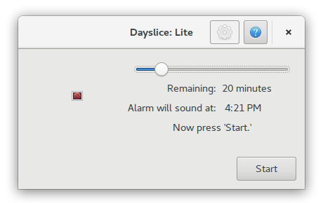

A simple tool for time boxing, possibly through the use of the
Pomodoro technique. A small part of a larger tool to come. Ought to
fit nicely on your [elementary](https://elementary.io/) desktop. By
Skrylar.

No payment is presently accepted for this project, although we will likely start accepting cryptocurrencies come v0.1.

Main program under the GPL2.

# Building, for the Brave

You need [Chibi Scheme](http://synthcode.com/scheme/chibi/) in order
to generate boilerplate code; then run it on `tools/statecraft.scm` in
order to create `src/fsm.vala`. By v0.1, a usable version of Chibi
along with the automation of this step will be included.

You will need [Meson](http://mesonbuild.com/) and
[Ninja](https://ninja-build.org/). Then, just simply run:

    mkdir build
    mesonbuild.py . build
    ninja -C build
